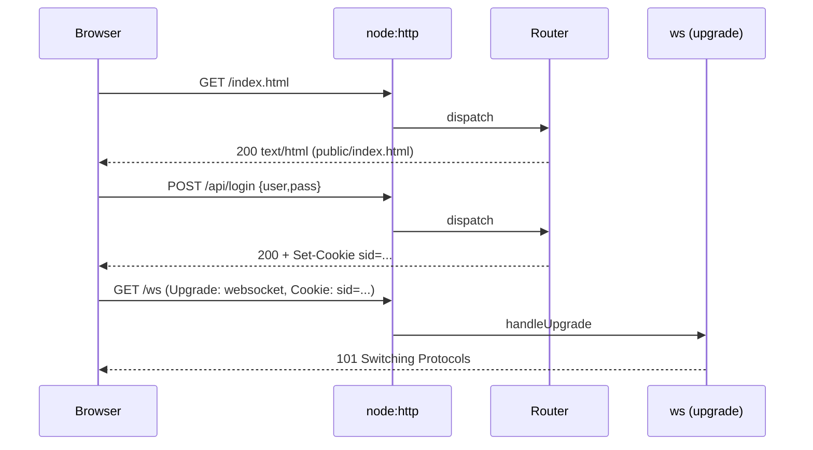

# ADR-0001: Backend runtime and framework

**Status**: accepted
**Date**: 2026-05-12
**Stories**: 01-register, 02-login, 03-create-match, 04-join-match, 05-multiplayer-sync

## Context

The Tris codebase is currently a static HTML page plus a single pure-logic
module (`game.js`). Sprint 03 turns it into a multi-user, real-time
application that must:

- serve the existing `index.html` (and `game.js`) over HTTP,
- expose JSON endpoints under `/api/*` for registration, login, logout,
  match creation, and match join,
- accept a WebSocket upgrade from the same origin for real-time match
  events,
- run in a single process on a developer laptop (prototype rigor — see
  `docs/rigor-level.md`).

We are constrained against pulling in "stack-vomit" dependencies
(Express + Passport + Sequelize, Next.js, etc.). Today the project has
zero runtime dependencies; `verify.sh` runs `node test.js` and nothing
else.

## Decision

We will build the server on **Node.js (LTS, >=18) using the built-in
`http` module** plus exactly **one** third-party dependency: **`ws`**
(`websockets/ws`) for the WebSocket upgrade handling (see ADR-0002 for
the transport decision itself).

There is **no web framework**. Routing is a small hand-written dispatch
table in `server/router.js` (one function: `match(method, path) -> handler`).
Static files (`/`, `/index.html`, `/game.js`, `/client.js`, `/styles.css`)
are served by a tiny static handler that maps URL paths to files under
`public/`. JSON request/response helpers live in `server/http-helpers.js`.

The server is started by `node server/index.js` and listens on a port
read from `PORT` (default `3000`). `verify.sh` is extended to spawn the
server on an ephemeral port, run an HTTP/WS integration smoke test, then
kill it — see ADR-0006 for the layout that makes this possible.

## Consequences

- positive:
  - Zero framework lock-in; every line of routing is greppable.
  - One new dep (`ws`) — easy to audit and well-maintained.
  - `node test.js` keeps working unchanged; pure-logic tests are still
    fast and dependency-free.
  - Same process serves static assets and the WS upgrade, so origin
    checks are trivial and no CORS layer is needed.
- negative:
  - We hand-roll request parsing (JSON body, cookies, URL params); a
    framework would give us that for free. Mitigation: tiny helpers in
    `server/http-helpers.js`, exercised by tests.
  - No middleware ecosystem (logging, rate-limiting, etc.). Acceptable
    at prototype rigor; revisit if we promote.
- neutral:
  - Locks us to Node 18+; aligns with platform LTS.
  - `package.json` is introduced (was absent) with `ws` as the sole
    `dependencies` entry. `npm install` becomes a precondition of
    `verify.sh`.

## Ports / Adapters

- `HttpServer` (port): exposes `listen(port)`, `on(method, path, handler)`,
  `onUpgrade(handler)`. Concrete adapter wraps `node:http`.
- `StaticFileHandler` (adapter): serves files from `public/` with
  conservative MIME types; no directory listing.
- `JsonHandler` (helper): parses request body (max 16 KB), writes
  `Content-Type: application/json` responses.

Endpoint contracts (locked here so wave-3 devs can stub each other):

| Method | Path                  | Body                          | 2xx Response                              | Errors |
|--------|-----------------------|-------------------------------|-------------------------------------------|--------|
| POST   | /api/register         | `{username, password}`        | `201 {ok:true}`                           | 400 `{error:"..."}` |
| POST   | /api/login            | `{username, password}`        | `200 {username}` + Set-Cookie             | 401 `{error:"Invalid username or password"}` |
| POST   | /api/logout           | (none)                        | `204`                                     | — |
| GET    | /api/me               | (none)                        | `200 {username}` or `401`                 | — |
| POST   | /api/matches          | (none)                        | `201 {code, role:"X"}`                    | 401 |
| POST   | /api/matches/:code/join | (none)                      | `200 {code, role:"O", opponent}`          | 401, 404 `{error:"Match not found"}`, 409 `{error:"Match is already full"}`, 409 `{error:"You cannot join your own match"}` |
| GET    | /ws                   | WebSocket upgrade             | (see ADR-0002)                            | 401 if not authenticated |

All `/api/*` endpoints (except `register` and `login`) require a valid
session cookie (see ADR-0003).

## Sequence

