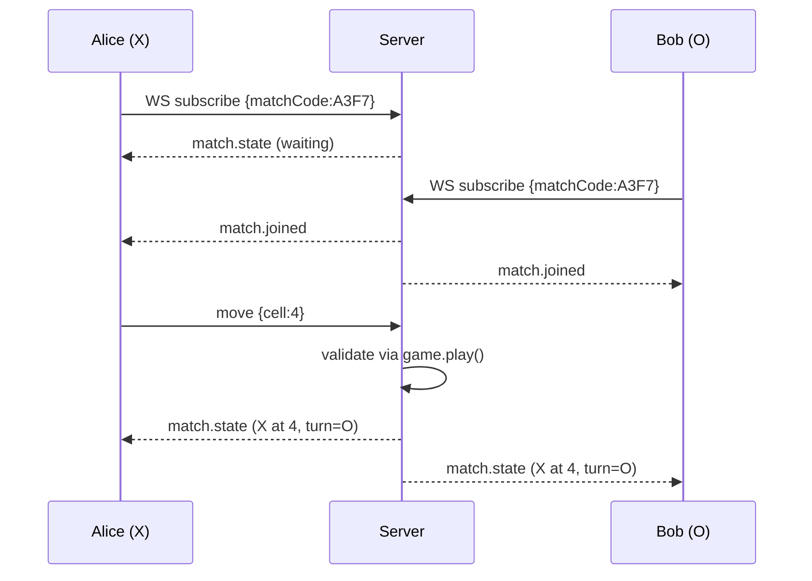

# ADR-0002: Realtime transport — WebSocket

**Status**: accepted
**Date**: 2026-05-12
**Stories**: 03-create-match, 04-join-match, 05-multiplayer-sync

## Context

Sprint 03 requires push-style updates: when Bob joins Alice's pending
match, Alice's screen must transition from "waiting" to the board
without a reload; when Alice plays a move, Bob sees it within 500 ms
(see story 05 NFR). Disconnects must also be detected so the opposing
player gets an "Opponent disconnected" notice.

Candidates considered:

1. **WebSocket** — full duplex, low overhead per message, native browser
   support, mature Node implementation in `ws`.
2. **Server-Sent Events (SSE)** — server-to-client push only; client
   would need a separate POST endpoint to send moves. Two-channel
   bookkeeping, plus reconnect semantics differ from WS.
3. **HTTP long-polling** — works everywhere but every move pays a full
   request/response round trip; the 500 ms latency budget gets tight as
   soon as keep-alive fails.

## Decision

We will use **WebSocket** for the real-time channel between client and
server, via the `ws` library on the server and the browser's native
`WebSocket` on the client. All match-scoped events (player joined,
move played, match ended, opponent disconnected, rematch requested)
flow over WS. Authentication is reused from the HTTP session cookie:
the upgrade request carries the `sid=...` cookie and the server rejects
unauthenticated upgrades.

A single WS endpoint `/ws` is used. After authentication, the client
sends a `subscribe` envelope to attach itself to a match; the server
maintains an in-memory map of `matchCode -> Set<connection>` and fans
out events from one connection to the other.

### Message envelope

All messages — both directions — are JSON with a `type` discriminator
and a flat payload. Server is the source of truth; client-to-server
messages are *intents* and the server is free to ignore them.

Client -> Server:

| type        | payload                  | meaning |
|-------------|--------------------------|---------|
| `subscribe` | `{matchCode}`            | attach this socket to a match |
| `move`      | `{matchCode, cell}`      | request to play `cell` (0..8) |
| `rematch`   | `{matchCode}`            | player ready for a rematch |

Server -> Client:

| type            | payload                                              | meaning |
|-----------------|------------------------------------------------------|---------|
| `match.state`   | `{code, board, turn, winner, draw, playerX, playerO, you}` | full snapshot — sent on every state change |
| `match.joined`  | `{code, playerX, playerO}`                           | second player just joined (also implies `match.state`) |
| `match.ended`   | `{code, winner, draw}`                               | game over |
| `match.rematch` | `{code, ready:{X:bool,O:bool}}`                      | rematch readiness ticker |
| `match.opponentLeft` | `{code}`                                        | the other socket dropped |
| `error`         | `{code?, message}`                                   | something the client sent was rejected |

Heartbeat: the server pings every 30 s; a missed pong for 60 s closes
the socket and triggers `match.opponentLeft` to the surviving peer.

## Consequences

- positive:
  - Single TCP connection per client; sub-100 ms move propagation on a
    local network.
  - Cookie-based auth works on the upgrade request — no extra token
    plumbing.
  - `ws` is a single, well-known dependency we already committed to in
    ADR-0001.
- negative:
  - Sticky-session requirement: in-memory `matchCode -> sockets` map
    cannot span processes. Acceptable at prototype rigor (single
    process); for production we would need a pub/sub bus (Redis, NATS).
  - We must implement our own heartbeat/timeout for disconnect
    detection; browsers do not always send a close frame on tab close.
- neutral:
  - The same envelope shape is used in both directions; clients may
    union-discriminate on `type`.

## Ports / Adapters

- `Transport` (port): `broadcast(matchCode, msg)`, `sendTo(connection, msg)`,
  `onMessage(connection, handler)`, `onClose(connection, handler)`.
- `WsTransport` (adapter): concrete `ws`-based implementation.
- `MatchHub` (module): owns the `matchCode -> Set<conn>` map and routes
  messages between `Transport` and `MatchStore` (see ADR-0004).

## Sequence

