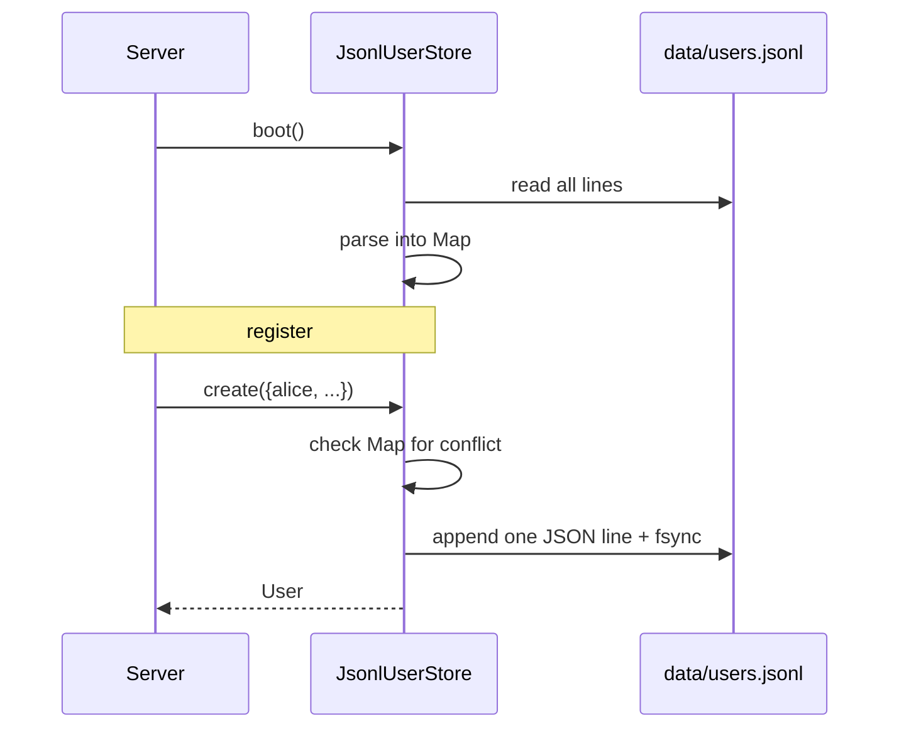

# ADR-0004: Persistence — in-memory + JSON snapshot for users; pure memory for matches

**Status**: accepted
**Date**: 2026-05-12
**Stories**: 01-register, 02-login, 03-create-match, 04-join-match

## Context

We need to store:

- **Users**: `{username, passwordHash, createdAt}`. Must survive a
  server restart (otherwise a registered user cannot log back in after
  the dev kills and restarts the server, which contradicts "an account
  with username X already exists" preconditions in stories).
- **Sessions**: covered in ADR-0003 — in-memory, intentionally
  ephemeral.
- **Matches**: `{code, playerX, playerO?, state, createdAt}`. Lifetime
  is at most one play session; abandoning the tab cancels the match
  (story 03 NFR). No need to survive a restart.
- **Leaderboard**: already persisted client-side in localStorage by the
  sprint-02 work. We **do not** centralize it on the server in this
  sprint; we revisit after multi-user play is stable.

Constraint: prototype rigor, no DB dependency, no migration story.

## Decision

We use **two different stores**, each behind a port:

1. **Users — in-memory `Map` with newline-delimited JSON (JSONL)
   append-on-write snapshot at `data/users.jsonl`.** On server startup
   the file is replayed line-by-line into the `Map`; on `register`, the
   server appends a single line and `fsync`s. The file format is one
   JSON record per line: `{"username":"...","hash":"...","createdAt":...}`.
   Append-only avoids any rewrite/rename complexity. If the file is
   missing, the server creates an empty one.

2. **Matches — in-memory `Map<code, Match>` only, no disk.** Matches
   are short-lived; on restart all matches are dropped (which is the
   same observable behavior as "all players disconnected").

The `data/` directory is created on startup if absent and is added to
`.gitignore`.

### Match record schema

```json
{
  "code": "A3F7",
  "createdAt": 1715500000000,
  "playerX": "alice",
  "playerO": null,
  "status": "waiting",
  "game": { "board": [null, ...], "turn": "X", "winner": null, "draw": false },
  "rematchReady": { "X": false, "O": false }
}
```

`status` is one of `waiting | active | ended | abandoned`. The
authoritative game progression is computed by importing `game.js` on
the server (see ADR-0006) — the server never re-implements
`play`/`detectWinner`.

### User record schema

```json
{
  "usernameLower": "alice",
  "usernameDisplay": "Alice",
  "hash": "scrypt$32768$8$1$<saltHex>$<keyHex>",
  "createdAt": 1715500000000
}
```

Uniqueness is enforced on `usernameLower` (case-insensitive — story 01).

## Consequences

- positive:
  - Zero dependencies for persistence.
  - JSONL append is crash-safe enough for prototype: a torn final line
    is detected at startup and skipped with a warning.
  - Matches in pure memory keep the implementation trivially testable.
- negative:
  - No deletes/updates on users in this sprint — username conflicts
    rely on the in-memory `Map` being authoritative once loaded. Fine
    for now.
  - Matches do not survive restart. If a tester restarts the server
    mid-game, both clients see "Opponent disconnected" on reconnect.
- neutral:
  - The `data/users.jsonl` file is human-inspectable but contains
    password hashes — readable only to the local user.

## Ports / Adapters

- `UserStore` (port):
  - `create({username, password}) -> Promise<User>` (throws on conflict)
  - `findByUsername(usernameAnyCase) -> Promise<User|null>`
- `JsonlUserStore` (adapter): backed by `data/users.jsonl`.
- `InMemoryUserStore` (adapter): used in tests.
- `MatchStore` (port):
  - `create(ownerUsername) -> Match`
  - `get(code) -> Match|null` (case-insensitive lookup)
  - `addOpponent(code, username) -> Match` (throws on full/self/missing)
  - `applyMove(code, username, cell) -> Match` (throws on wrong-turn/etc.)
  - `cancelOwned(ownerUsername) -> void` (used when a user logs out or
    creates a second match)
- `InMemoryMatchStore` (adapter): the only impl in this sprint.

## Sequence


