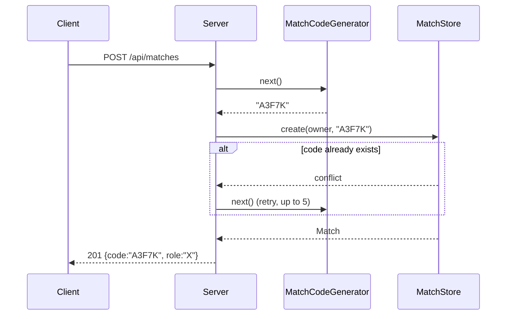

# ADR-0005: Match code format

**Status**: accepted
**Date**: 2026-05-12
**Stories**: 03-create-match, 04-join-match

## Context

Story 03 (AC-2) requires "a unique, human-readable match code of 4–8
uppercase alphanumeric characters". Story 04 (AC-7) requires case-
insensitive lookup. Codes are shared verbally and by chat, so confusable
characters (`0`/`O`, `1`/`I`/`L`) are a real friction point.

The code must be:

- short enough to type/dictate,
- safe against trivial collision over a single play session (tens to
  hundreds of concurrent matches at most, prototype rigor),
- regeneratable on collision without UI churn,
- bound to a single match instance, expiring when that match ends or
  is cancelled.

## Decision

**Match codes are 5 characters from the alphabet `ABCDEFGHJKLMNPQRSTUVWXYZ23456789`** (24 letters + 8 digits = 32 symbols; we drop `I`, `O`, `0`, `1` for legibility).

- Length: **5**. This sits inside the spec window of 4–8 and gives
  `32^5 = 33,554,432` possibilities — three orders of magnitude past
  realistic concurrent-match counts at prototype scale.
- Generation: `crypto.randomBytes(5)` → map each byte to one of 32
  symbols by `byte & 31`. This is unbiased because 32 divides 256.
- Collision strategy: on creation the server retries generation up to
  **5 times** if the new code already exists in `MatchStore`. After 5
  collisions (effectively never at prototype scale) the request fails
  with `500 {error:"Could not generate match code"}`.
- Case handling: codes are stored uppercase. Lookups uppercase the
  input first (story 04, scenario "Match code input is case-
  insensitive").
- Lifetime: a code exists from the moment `POST /api/matches` returns
  it until any of:
  - the second player joins (still valid, but no further joins are
    accepted — story 04, "Match is already full"),
  - the creator logs out (story 03, "Navigating away cancels the
    pending match"),
  - the creator creates another match (story 03, "Attempting to create
    a second match while one is pending cancels the first"),
  - the match ends (won/drawn) and no rematch is requested,
  - a server restart (matches live in memory only — ADR-0004).
- Display: shown verbatim with a `Copy code` button next to it (story
  03 AC-4).

## Consequences

- positive:
  - Easy to read and dictate; no `0`/`O` or `1`/`I` confusion.
  - Generation is uniform (32 divides 256) and cryptographically
    seeded.
  - 5 characters fit comfortably inside the 4–8 range; if the UX team
    later asks for shorter codes we can drop to 4 without a server
    change beyond a constant.
- negative:
  - The alphabet is non-standard, so we need to document it once and
    ensure the client input field uppercases and rejects out-of-
    alphabet characters before POSTing.
- neutral:
  - 32 symbols means a tighter alphabet than full alphanumeric, but
    user friction (re-keying after typo) drops more than it costs.

## Ports / Adapters

- `MatchCodeGenerator` (port): `next() -> string`. Pluggable so tests
  can inject a deterministic sequence.
- `RandomMatchCodeGenerator` (adapter): uses `crypto.randomBytes`.
- `SequenceMatchCodeGenerator` (test adapter): yields codes from a
  preset list.

The retry-on-collision loop lives in `MatchStore.create`, not in the
generator, so the generator is pure.

## Sequence

