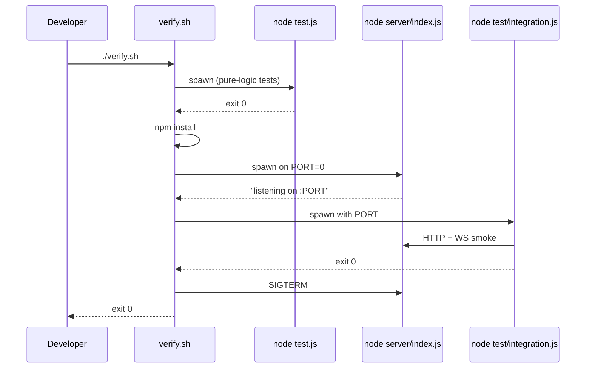

# ADR-0006: Shared `game.js` module and repository layout

**Status**: accepted
**Date**: 2026-05-12
**Stories**: 03-create-match, 04-join-match, 05-multiplayer-sync

## Context

`game.js` is the project's crown jewel: a small, pure, well-tested
module exporting `createGame`, `play`, `detectWinner`, `statusText`,
`fromString`, `resolveName`, `applyResult`, `awardWin`, `topN`. It is
the canonical authority for what is a legal move and who has won. We
must not duplicate this logic on the server.

Constraints:

- The browser loads `game.js` via a plain `<script src="game.js">` tag
  (no bundler), so the file must remain usable as a classic script.
- Node loads `game.js` via `require('./game.js')` (see `test.js`).
- The existing file already does both: globals for the browser, a
  `module.exports = ...` block at the bottom for Node. We preserve that
  pattern.

Today every file is at the repo root. With a server added, that gets
crowded. We need a layout where the same `game.js` file is reachable
both from the static `index.html` URL and from the Node `require()`.

## Decision

We adopt the following layout:

```
smurf-test/
  package.json            # new — declares "ws" dep and the start script
  verify.sh               # extended (see below)
  public/                 # everything the HTTP server exposes as static
    index.html            # moved from repo root
    client.js             # new — client-side glue (auth, lobby, ws)
    styles.css            # extracted from index.html (optional, dev choice)
    game.js               # symlink or build-time copy of /shared/game.js
  shared/
    game.js               # moved here — single source of truth
  server/
    index.js              # entrypoint: boots http + ws
    router.js             # request dispatch
    http-helpers.js       # body parsing, cookie codec
    auth.js               # ScryptHasher, MemorySessionStore
    user-store.js         # JsonlUserStore (ADR-0004)
    match-store.js        # InMemoryMatchStore
    match-hub.js          # connection map + event fan-out
    match-codes.js        # RandomMatchCodeGenerator
  test.js                 # adjusted to require('./shared/game.js')
  data/                   # gitignored — users.jsonl lives here
  docs/
    adr/                  # this directory
    stories/
```

### How `public/game.js` stays in sync with `shared/game.js`

Two acceptable implementations (developer's choice in wave 3 — both are
trivial):

1. **Symlink** `public/game.js -> ../shared/game.js`. Works on macOS,
   Linux, and modern Windows. Node static handler must resolve and
   serve the target.
2. **Copy on server start.** `server/index.js` copies
   `shared/game.js` to `public/game.js` at boot. `public/game.js` is
   gitignored.

We default to **option 2** (copy on boot) because it sidesteps symlink-
on-Windows headaches and keeps the static handler dumb.

### Shared module contract

`shared/game.js` keeps its current exports. The server uses
`play(state, cell)` exactly as the client does. Crucially:

- The server creates and owns the authoritative `state`.
- The server validates `move` messages by calling `play(state, cell)`
  and comparing the returned reference: if `next === state` the move
  was illegal (either out of range, occupied, or game over) and the
  server sends an `error` message instead of broadcasting.
- The server also enforces *whose turn it is* by comparing the
  authenticated username against `playerX`/`playerO` for the current
  `state.turn`.
- The client may render moves optimistically by calling `play` locally,
  but **must reconcile** with the next `match.state` broadcast.

No new exports are added to `shared/game.js` in this sprint.

### `verify.sh` extension

`verify.sh` continues to:

1. run `node test.js` (the existing pure-logic tests, now pointing at
   `shared/game.js`).

It additionally runs an integration smoke test:

2. `npm install --no-audit --no-fund` (idempotent).
3. Start `node server/index.js` on an ephemeral port (`PORT=0`).
4. Run `node test/integration.js` against that port — exercising
   register, login, create-match, join-match, and a single move
   round-trip over WS.
5. Tear down the server process on exit (trap).

The shim contract (smurf agents call only `verify.sh`) is preserved.

## Consequences

- positive:
  - One copy of the game rules; no risk of client/server drift.
  - Clear top-level boundary: `public/` is everything the browser sees,
    `server/` is server-only, `shared/` is both.
  - `test.js` still runs in isolation — the integration step is
    optional inside `verify.sh` and skipped if `npm install` is
    impossible.
- negative:
  - One more level of directory nesting; existing `index.html` and
    `game.js` move (a one-time mechanical change).
  - Boot-time copy of `game.js` is a tiny bit of magic. Documented
    here.
- neutral:
  - `package.json` becomes mandatory; introduces `node_modules/`
    (gitignored).

## Ports / Adapters

This ADR is primarily a layout decision; the modules it introduces are
the ports/adapters listed in ADR-0001 through ADR-0005 plus:

- `GameRules` (port, implicit): the surface `createGame`, `play`,
  `detectWinner` from `shared/game.js`. Both client and server depend
  on it; no other implementations are expected.

## Sequence


