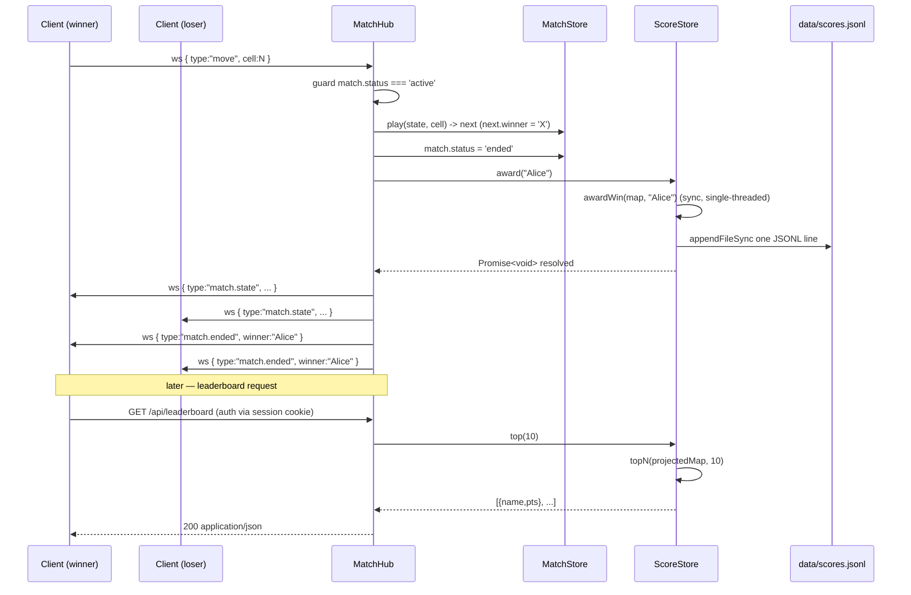

# ADR-0007: ScoreStore — server-side win scoring with JSONL persistence

**Status**: accepted
**Date**: 2026-05-12
**Stories**: sprint-04/03-score-store-and-leaderboard-api, sprint-04/04-match-hub-win-scoring, sprint-04/05-leaderboard-page-live-data

**Supersedes**: the leaderboard deferral in ADR-0004. ADR-0004 remains
accepted for users + matches; its bullet stating "Leaderboard ... we do
not centralize it on the server in this sprint" is obsoleted by this
ADR.

## Context

Sprint-04 promotes the leaderboard from a client-side localStorage
trinket (sprint-02) to a server-owned, ranked, persistent table.
Concretely:

- Story 03 demands a `ScoreStore` port + `JsonlScoreStore` /
  `InMemoryScoreStore` adapters and a `GET /api/leaderboard` HTTP
  endpoint returning the top 10 ranked entries.
- Story 04 demands that `MatchHub` awards exactly one point to the
  winner of a terminated match, with draws and abandons awarding
  nothing, and with the existing `if (match.status !== 'active')`
  guard preventing double-credit on replays.
- Story 05 demands that `/leaderboard.html` renders the live API
  response (no fake data, no localStorage fallback).

Constraints carried over from prior ADRs:

- **No new dependencies** (ADR-0001 — Node stdlib only).
- **Persistence pattern mirrors `JsonlUserStore`** (ADR-0004) — JSONL,
  append-only, replay-on-boot, torn-final-line tolerated.
- **All scoring arithmetic delegates to `shared/game.js`**
  (ADR-0006) — adapters call `awardWin` and `topN`; they never
  re-implement the math.

`shared/game.js` exports:

```js
awardWin(store, name) -> store'   // store is { [name]: pts }
topN(store, n)        -> [{ name, pts }, ...]   // sorted desc, ties ASC, capped at n
```

These exports are already covered by the sprint-02 unit tests in
`test.js` (incl. the "topN returns at most 10 entries" cap).

## Decision

We introduce a single new port, `ScoreStore`, with two adapters
following the exact shape of `UserStore` / `JsonlUserStore` /
`InMemoryUserStore`.

### Port

```
award(usernameDisplay) -> Promise<void>
top(n)                 -> Promise<[{ name, pts }, ...]>
```

- `award` increments the named user's total by exactly 1.
- `top` returns at most `n` entries ranked by `pts` DESC, name ASC for
  ties. The HTTP layer always calls `top(10)`; the cap is policy, not a
  hard limit of the port. `n` defaults to 10.
- The port deals in **display names** (`usernameDisplay`). The
  case-insensitive identity key (`usernameLower`) is internal to the
  store; callers (MatchHub, HTTP) pass the display name they already
  hold and read display names back. This matches how `awardWin` /
  `topN` already work in `shared/game.js` (keyed by a single string).

### Persistence — JSONL append-only with replay-sums-increments

Production adapter `JsonlScoreStore` is backed by `data/scores.jsonl`.
Each `award` call appends **one line** representing **one +1 delta**:

```json
{"usernameLower":"alice","usernameDisplay":"Alice","delta":1,"at":1715500000000}
```

On boot the store reads the file line by line and **sums deltas** into
an in-memory `Map<usernameLower, { usernameDisplay, pts }>`. We chose
replay-sums-increments (rather than "last record wins, snapshot per
line") because:

- It is strictly append-only: no record ever mutates a prior record's
  meaning. A torn final line on crash loses at most the most recent
  award, never corrupts an older one.
- It mirrors the `JsonlUserStore` invariant ("file is the log; map is
  the projection") that ADR-0004 already establishes for users.
- The arithmetic that produces the per-name total is `awardWin(store,
  name)` applied once per delta — i.e. exactly the helper from
  `shared/game.js`. We do not re-implement summation in the adapter.

When a torn (partial / unparseable) line is encountered during
replay, the adapter logs `console.warn('[score-store] skipping
malformed line')` and continues — same behaviour as `JsonlUserStore`
(see `server/user-store.js` lines 26-30).

### Why JSONL and not a single JSON snapshot

- Snapshots require rewrite-then-rename to be crash-safe. JSONL append
  is one syscall and inherently atomic at line boundaries on local
  filesystems for record sizes well below `PIPE_BUF`. Each of our
  records is ~80 bytes.
- The users store already established this pattern. Two persistence
  styles in one prototype is one too many.
- Operators can `tail -f data/scores.jsonl` to watch live awards — a
  free debug aid.

The negative — file grows monotonically — is acceptable at prototype
scale. A future ADR will introduce compaction (replace the file with a
single snapshot of the in-memory map) when the file exceeds, e.g., 10
MB. That is explicitly out of scope here.

### Idempotency, concurrency, and the "single-threaded Node" assumption

Story 03 AC-6 calls out that two concurrent `award("eve")` Promises
must not double-credit. Node executes JavaScript on a single thread;
the body of `award` from the synchronous `awardWin` call through the
in-memory `Map.set` and the synchronous `fs.appendFileSync` runs to
completion before any other JS task observes the map. **We therefore
explicitly choose NOT to add a per-username queue or mutex.** The
serialisation the story asks for is provided by the JS event loop,
not by adapter code.

Concretely:

```js
async award(usernameDisplay) {
  const lower = usernameDisplay.toLowerCase();
  const cur = this._map.get(lower) || { usernameDisplay, pts: 0 };
  // awardWin from shared/game.js — operates on { [name]: pts }
  const next = awardWin({ [usernameDisplay]: cur.pts }, usernameDisplay);
  cur.pts = next[usernameDisplay];
  cur.usernameDisplay = usernameDisplay; // preserves casing of latest award
  this._map.set(lower, cur);
  const line = JSON.stringify({ usernameLower: lower, usernameDisplay, delta: 1, at: Date.now() }) + '\n';
  fs.appendFileSync(this._file, line);  // synchronous; resolves the Promise on return
}
```

The function is `async` only so its signature matches the port (and so
the caller can `await` it); there are no `await` points inside, which
is what makes the two-concurrent-Promises scenario from story 03
trivially safe. **This assumption MUST be documented in the adapter's
JSDoc** so a future dev who is tempted to introduce `await
fs.promises.appendFile` understands they would also need to add a
serialisation primitive.

Error handling: a `fs.appendFileSync` failure throws synchronously,
which rejects the returned Promise. Story 04 AC-5 says callers
(MatchHub) must `.catch(console.error)` the rejection without
disconnecting clients. The store itself **never swallows** the error.

### Match-end hook (story 04)

`MatchHub` receives the `ScoreStore` via constructor injection:

```js
new MatchHub(matchStore, sessionStore, scoreStore)
```

In `_move`, after `play()` returns `next` with `next.winner` set and
**before** the `match.ended` broadcast, `MatchHub` resolves the
winner's username from `match.playerX` / `match.playerO` and calls
`scoreStore.award(winnerUsername).catch(err => console.error(...))`.

The existing guard `if (match.status !== 'active')` is the
**sole** idempotency mechanism. We do not add a `match.scored` flag —
the status transition `active → ended` happens **inside** `_move`
exactly once, and subsequent move messages bounce off the guard. This
is the explicit design choice that AC-6 of story 04 ratifies.

Draws (`next.draw === true`) and abandons (set in `_onClose`) **never**
call `award`. The branch is gated on `next.winner` truthiness.

### Top-N cap

The HTTP handler `GET /api/leaderboard` calls `scoreStore.top(10)`.
Ten is the user-visible cap (story 03 AC, story 05 AC). Story 03's
scenario "more than 10 recorded players caps at 10" is satisfied by
the existing `topN` slice in `shared/game.js` (see test.js line 196).
The number `10` lives in the HTTP handler — not as a hardcoded
constant inside the store — so a future "show top 25" view can call
`top(25)` without an adapter change.

## Consequences

- positive:
  - Zero new dependencies; pattern is bit-for-bit identical to
    `JsonlUserStore` so a dev who has read `server/user-store.js` can
    implement the adapter in one sitting.
  - Append-only log is crash-safe at the granularity of a single
    award (loses at most one +1 on hard crash).
  - All ranking arithmetic stays inside `shared/game.js`, preserving
    ADR-0006's "one source of truth" invariant. The unit tests in
    `test.js` that already cover `awardWin` and `topN` transitively
    cover the store's correctness.
  - `tail -f data/scores.jsonl` gives operators a live award stream.
- negative:
  - File grows without bound. Compaction is a future ADR.
  - The "single-threaded Node assumption" is load-bearing. A future
    refactor to `async` I/O inside `award` must add explicit
    serialisation; this is called out in adapter JSDoc per the
    decision above.
- neutral:
  - The on-disk schema (`{usernameLower, usernameDisplay, delta, at}`)
    differs from the in-memory shape (`{usernameDisplay, pts}`).
    Replay reconstructs the latter from the former. This is the same
    log-vs-projection split that `JsonlUserStore` uses (record on
    disk, `Map` in memory).
  - `usernameDisplay` from the most recent award wins when the same
    user's casing changes between sessions. Acceptable: usernames are
    `^[A-Za-z0-9_]+$` and case is a display concern only.

## Ports / Adapters

- `ScoreStore` (port):
  - `award(usernameDisplay) -> Promise<void>` — increments by 1.
    Delegates to `awardWin` from `shared/game.js`. Synchronous body;
    `async` only for signature uniformity.
  - `top(n = 10) -> Promise<[{ name, pts }, ...]>` — delegates to
    `topN` from `shared/game.js`. Caller passes the cap.
- `JsonlScoreStore` (production adapter): `data/scores.jsonl`,
  append-only, replay-sums-increments, torn-line-tolerant.
- `InMemoryScoreStore` (test adapter): same surface, no disk.

Consumed by:
- `MatchHub` (story 04) — receives the store via constructor; calls
  `award` once per terminal `match.ended` where `winner !== null`.
- `GET /api/leaderboard` handler in `server/index.js` (story 03) —
  calls `top(10)`, requires an authenticated session, returns JSON.

## Sequence


