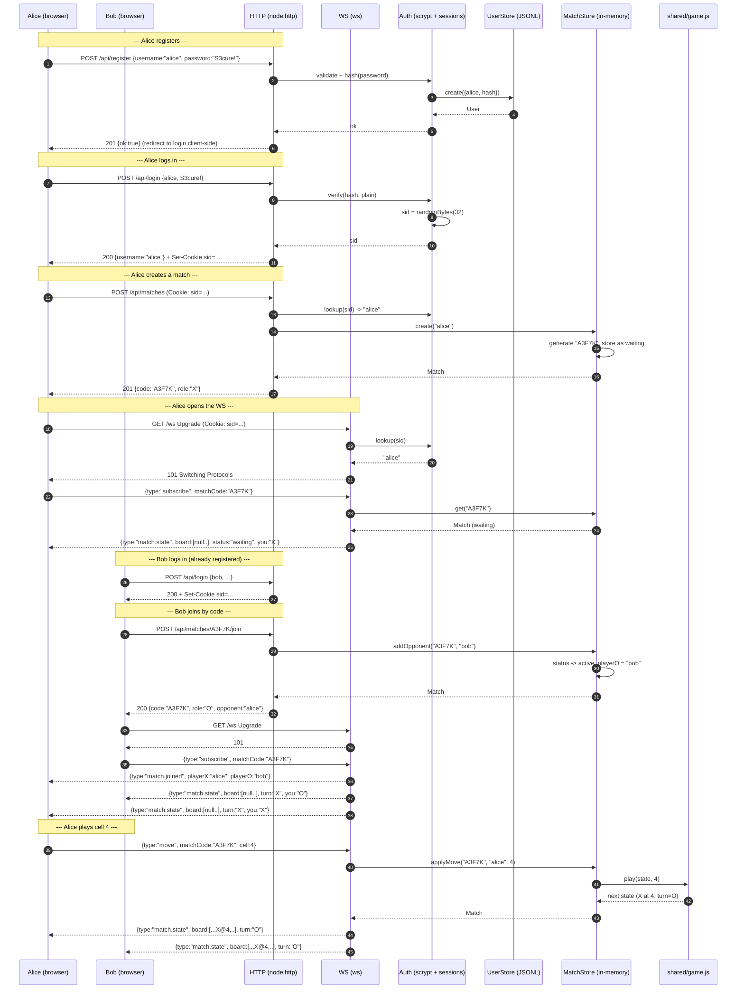

# Sequence: register, login, create match, join, first move

End-to-end happy path that ties ADR-0001..0006 together. Two browsers,
one server.

Key invariants this diagram enforces:

- `sid` cookie is the only auth credential — HTTP and WS share it.
- `MatchStore` is the only writer of game state; `shared/game.js`
  computes the next state, the server stores it.
- Both players receive `match.state` for every transition — there is
  no client-only state that needs to be reconciled by polling.
